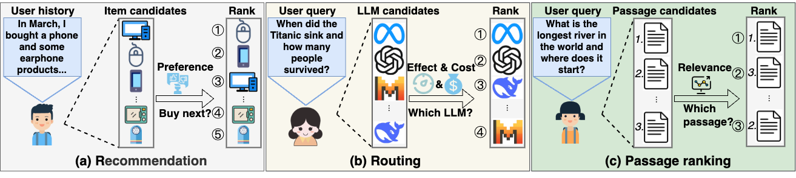
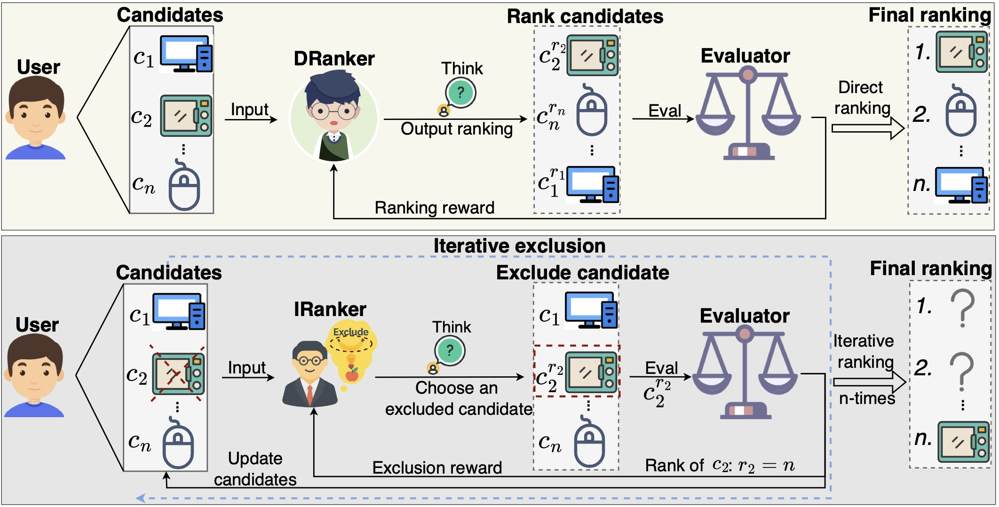

# R1-Ranker: Teaching LLM Rankers to Reason

<p align="center">
    <a href="https://ulab-uiuc.github.io/IRanker/">
        
    </a>
    <a href="https://arxiv.org/abs/2506.21638">
        
    </a>
    <!-- <a href="xxx">
        
    </a> -->
    <a href="https://github.com/ulab-uiuc/IRanker/blob/master/LICENSE">
        
    </a>
    <br>
    <a href="https://github.com/ulab-uiuc/IRanker">
        
    </a>
    <a href="https://github.com/ulab-uiuc/IRanker">
        
    </a>
    <a href="https://github.com/ulab-uiuc/IRanker">
        
    </a>
</p>


<p align="center">
    <a href="https://ulab-uiuc.github.io/IRanker/">🌐 Project Page</a> |
    <a href="https://arxiv.org/pdf/2506.21638">📜 arXiv</a> |
    <a href="https://huggingface.co/datasets/ulab-ai/Ranking-bench">🤗 HuggingFace</a>
</p>


<!-- Applicable Scenarios Section -->
<h3 align="center">📌 Applicable Scenarios</h3>

<p align="center">
  Our <b>Ranking FM</b> framework is designed to unify <b>Recommendation</b>, <b>Routing</b>, and <b>Passage Ranking</b> tasks under a single ranking foundation model. The figure below illustrates how it can be instantiated across these diverse applications.
</p>

<div align="center">
  
</div>

<br/>

<!-- Method Section -->
<h3 align="center">🧠 Method</h3>

<p align="center">
  We instantiate the Ranking FM using two RL-enhanced LLM frameworks: <b>DRanker</b> and <b>IRanker</b>.
</p>

<ul style="text-align: left; margin: 0 auto; max-width: 700px;">
  <li><b>DRanker</b>: performs <i>direct ranking optimization</i> in a one-shot manner, predicting the full ranking list directly.</li>
  <li><b>IRanker</b>: adopts an <i>iterative ranking formulation</i> that progressively refines the ranking list step-by-step.</li>
</ul>


<p align="center">
  Despite their different training paradigms, both frameworks share a common objective: optimizing the ranking quality through reinforcement learning over LLM outputs.
</p>

<div align="center">
  
</div>


## 📌Preliminary


### Environment Setup

```shell
conda create -n iranker python=3.9
# install torch [or you can skip this step and let vllm to install the correct version for you]
pip install torch==2.4.0 --index-url https://download.pytorch.org/whl/cu121
# install vllm
pip3 install vllm==0.6.3 # or you can install 0.5.4, 0.4.2 and 0.3.1
pip3 install ray

# verl
pip install -e .

# flash attention 2
pip3 install flash-attn --no-build-isolation
# quality of life
pip install wandb IPython matplotlib

```
## 📊 Dataset Preparation

This section outlines the steps to generate the datasets used for DRanker and IRanker training and evaluation.

### Raw Dataset

The original raw dataset is available for download from Hugging Face:

**Dataset Repository:** [ulab-ai/Ranking-bench](https://huggingface.co/datasets/ulab-ai/Ranking-bench)

### DRanker Dataset

To generate the DRanker dataset, run the following command:

```bash
python examples/data_preprocess/direct_data_generation.py
```

The processed dataset will be saved to: `data/direct_ranking`

### IRanker Dataset

To generate the IRanker dataset, execute this script:

```bash
python examples/data_preprocess/iterative_data_generation.py
```

The processed dataset will be saved to: `data/iterative_ranking`


## ⭐Experiments


### 🧠 Training

To train DRanker, you can use this script:
```bash
CUDA_VISIBLE_DEVICES=0,1,2,3
N_GPUS=4
BASE_MODEL=<path_to_base_model>
DATA_DIR=data/direct_ranking
ROLLOUT_TP_SIZE=1
EXPERIMENT_NAME=direct_ranking
VLLM_ATTENTION_BACKEND=XFORMERS

bash ./scripts/Ranking_FM.sh
```
The trained DRanker model will be saved in the folder of ./checkpoints/Ranking-FM/direct_ranking/actor.


To train IRanker, you can use this script:
```bash
CUDA_VISIBLE_DEVICES=0,1,2,3
N_GPUS=4
BASE_MODEL=<path_to_base_model>
DATA_DIR=data/iterative_ranking
ROLLOUT_TP_SIZE=1
EXPERIMENT_NAME=iterative_ranking
VLLM_ATTENTION_BACKEND=XFORMERS

bash ./scripts/Ranking_FM.sh
```
The trained IRanker model will be saved in the folder of ./checkpoints/Ranking-FM/iterative_ranking/actor.

### 🔍 Evaluation

#### Running Evaluation

To evaluate a model on a specific dataset, use the following command:

```bash
python eval/eval.py --dataset <dataset_name> --model_path <path_to_model>
```

#### Parameters

- `--dataset`: Specifies the dataset to evaluate on
- `--model_path`: Path to the trained model you want to evaluate

#### Supported Datasets

The evaluation script supports the following datasets:

#### Recommendation Systems
- `Rec-Movie` 
- `Rec-Music` 
- `Rec-Game`
 

#### Router Tasks
- `Router-Performance`
- `Router-Balance` 
- `Router-Cost`

#### Passage Ranking
- `Passage-5` 
- `Passage-7` 
- `Passage-9`


## 📝 Acknowledgement

The concept of **IRanker** is inspired by [Deepseek-R1](https://github.com/deepseek-ai/DeepSeek-RL) and [TinyZero](https://github.com/OpenLLM-TinyModels/TinyZero). Its implementation is built upon [veRL](https://github.com/PKU-Alignment/veRL).

We sincerely appreciate the efforts of these teams for their contributions to open-source research and development.

## Citation

```bibtex
@article{feng2025iranker,
  title={IRanker: Towards Ranking Foundation Model},
  author={Feng, Tao and Hua, Zhigang and Lei, Zijie and Xie, Yan and Yang, Shuang and Long, Bo and You, Jiaxuan},
  journal={arXiv preprint arXiv:2506.21638},
  year={2025}
}
```


<!-- <picture>
<source media="(prefers-color-scheme: dark)" srcset="https://api.star-history.com/svg?repos=ulab-uiuc%2FGraphEval&theme=dark&type=Date">

</picture> -->
